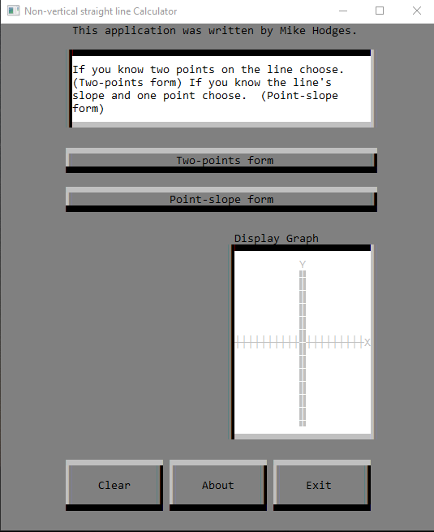
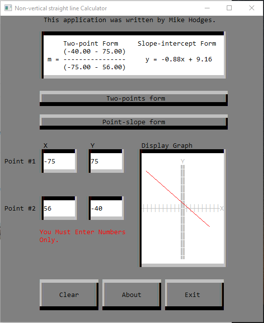
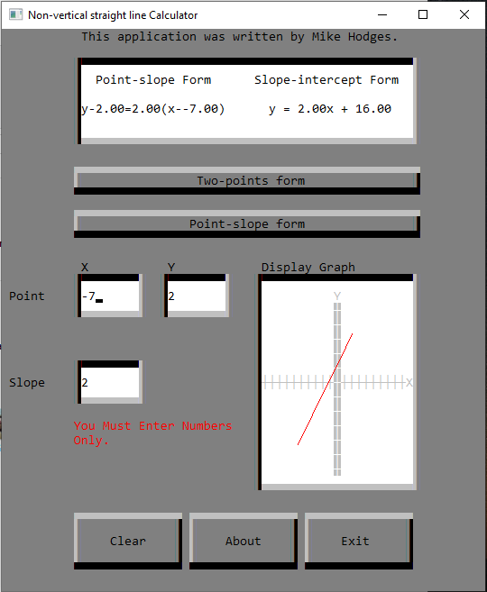

# Models of Non-Vertical Line
This project features a VB-style interface written entirely in C++, using ASCII characters to create graphical elements. The application mimics Visual Basic functionalities with a text-based UI, providing an interactive environment for calculating the equation of a non-vertical line given two points. This project was created for a C++ programming class at Valencia College. Instead of submitting basic command-line responses, this project mimics Visual Basic functionalities using ASCII characters. 

## Features

- **VB-Style Interface**: Built from scratch using C++.
- **ASCII Graphical Elements**: Utilizes ASCII characters to mimic Visual Basic elements.
- **Two-Point Form Calculation**: Computes and displays the slope and two-point form equation.
- **Slope-Intercept Form Calculation**: Converts the two-point form to the slope-intercept form and displays the equation.
- **Graphical Display**: Visualizes the line on a coordinate grid based on the input points.
- **Error Handling**: Ensures users enter valid numerical values.
- **Interactive Elements**: Implements buttons, text fields, and more with ASCII characters.
- **Tab Indexing**: Allows navigation through interface elements.
- **Clear, About, and Exit Buttons**: Provides standard functionalities to clear inputs, show application info, and exit the program.

## Project Structure

- `main.c`: Entry point of the program.
- `ui.c`: Contains functions for the ASCII-based user interface.
- `elements.c`: Manages buttons, text fields, and their behaviors.
- `utils.c`: Utility functions for handling input and rendering.

## Usage

1. Clone the repository:
    ```bash
    git clone https://github.com/MikeHodges-IT/models_of_non_vertical_line.git
    ```
2. Compile the project:
    ```bash
    gcc main.c ui.c elements.c utils.c -o models_of_non_vertical_line
    ```
3. Run the executable:
    ```bash
    ./models_of_non_vertical_line
    ```

Alternatively, you can download and run the precompiled executable directly:
- [Download models_of_non_vertical_line.exe](https://github.com/MikeHodges-IT/models_of_non_vertical_line/blob/master/Debug/Assg_07_%20models_of_non_vertical_line.exe)

## Description

This application provides a graphical interface for calculating the equation of a non-vertical line given two points. Users can input the X and Y coordinates of two points, and the application will display the two-point form and slope-intercept form of the line. The graph is displayed within the interface, showcasing the line based on the given points.

**Functionalities include:**

- **Two-Point Form Calculation:** Computes and displays the slope and two-point form equation.
- **Slope-Intercept Form Calculation:** Converts the two-point form to the slope-intercept form and displays the equation.
- **Graphical Display:** Visualizes the line on a coordinate grid based on the input points.
- **Error Handling:** Ensures users enter valid numerical values.
- **Clear, About, and Exit Buttons:** Provides standard functionalities to clear inputs, show application info, and exit the program.

## Going Above and Beyond

This project goes beyond the basic requirements, demonstrating my love of learning and programming. By integrating advanced UI features and ensuring a user-friendly interface, I aimed to create a comprehensive and engaging tool that showcases my commitment to excellence.

## Screenshots





This screenshot shows an ASCII-based UI for a Non-Vertical Straight Line Calculator, featuring input fields for coordinates,
buttons for form selection and actions, and a graph display area.

## Contribution

Feel free to fork this repository, submit issues, and make pull requests. Contributions are welcome!

## License

This project is licensed under the MIT License.
